

<h1>
	Hello World 👋  
</h1>	
Visited   

  
times.

This is me! You can take a look at the projects I have done, learning repos to see what I studied and homeworks that I've done/am doing/will do throughout my education. If you have any advice, improvements or notice a bug, feel free to submit an issue! Contributions are welcomed! *YAY OPEN-SOURCE!!*
 
 

- 🔭 I’m not currently employed. 
- 🌱 I’m currently extending my knowledge on artificial intelligence and its derivatives. 
- 👯 I’m looking to collaborate on any fun project related to my area & appropriate for my skillset! 
- 📫 How to reach me: https://www.linkedin.com/in/murat-bayraktar-a361b2189/ 
- Or you can also send e-mail: bayraktar.murat@metu.edu.tr 
- ⚡ Fun fact: I play improv blues and jazz piano, so if you wanna jam, shoot a message! 

## Showcase
<!-- 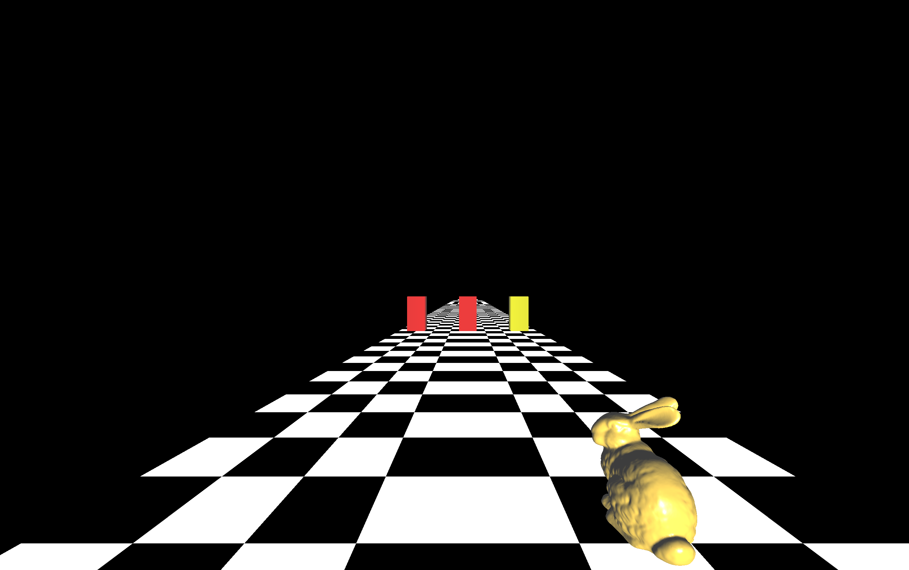 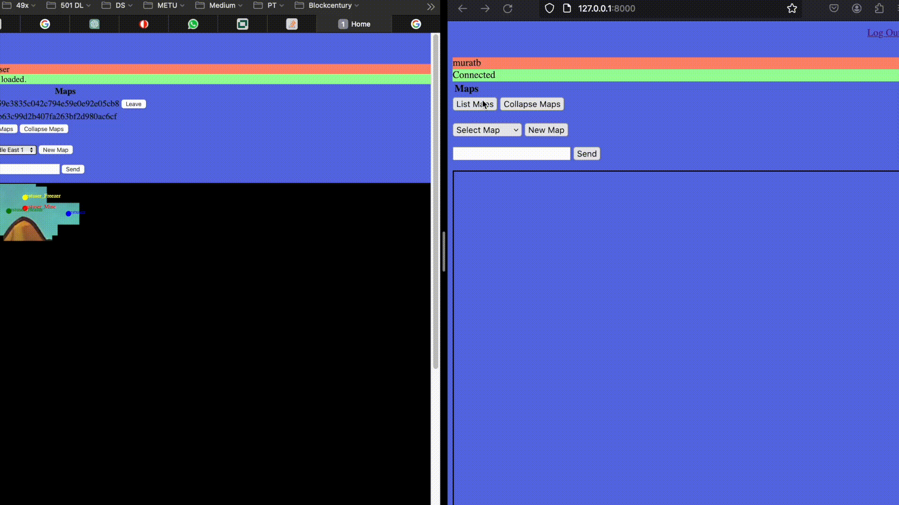 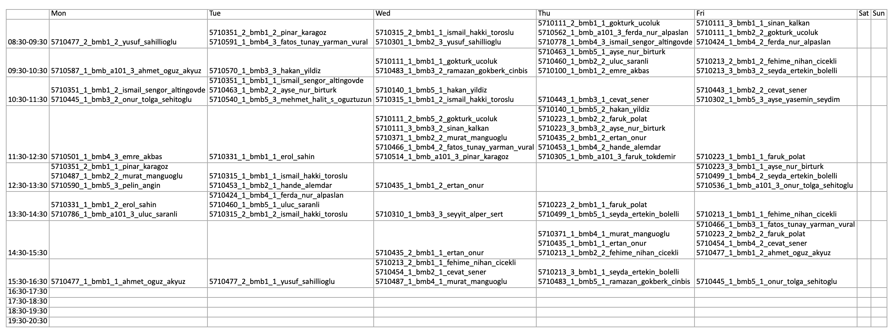 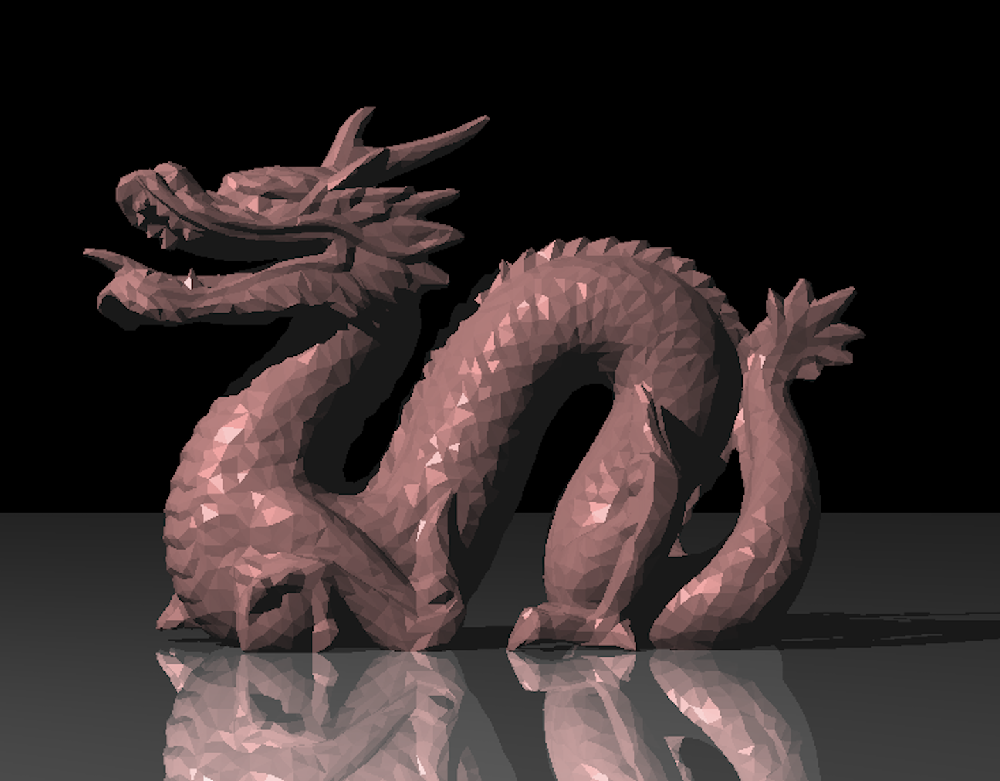 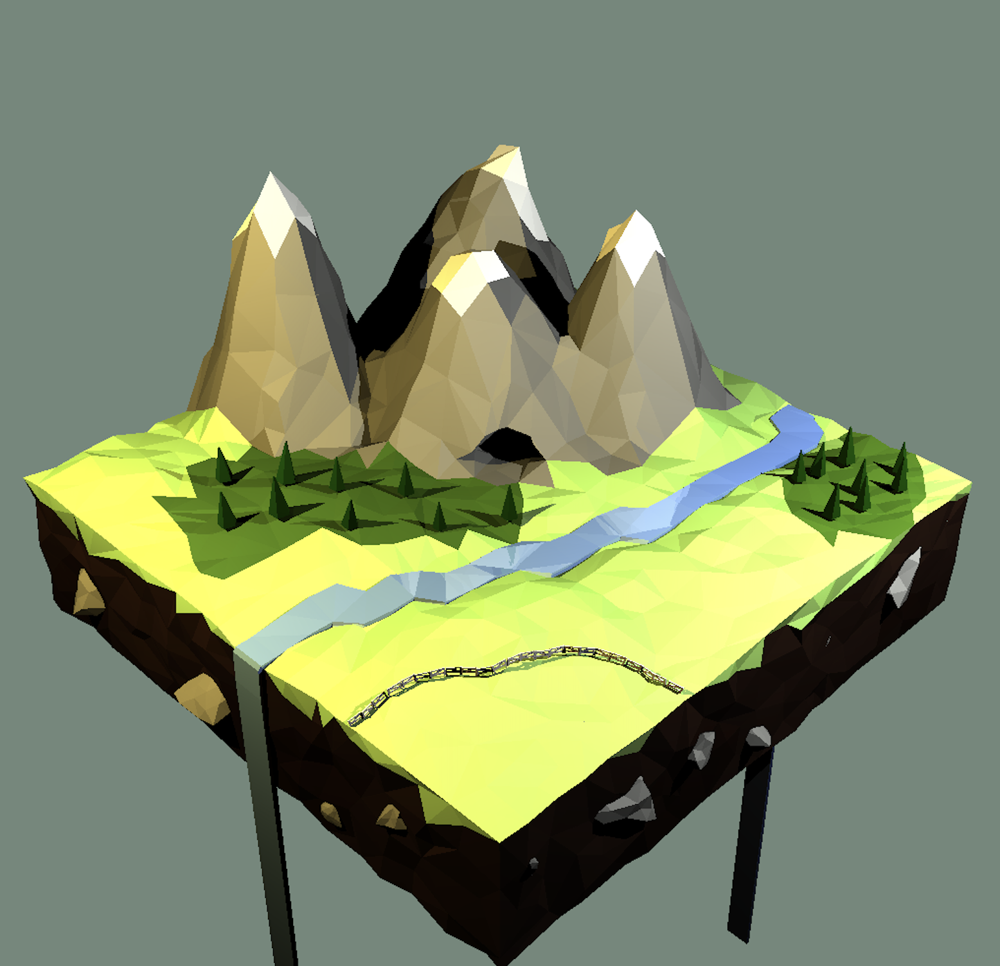 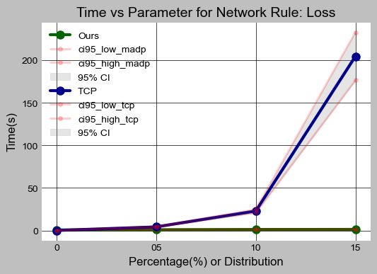 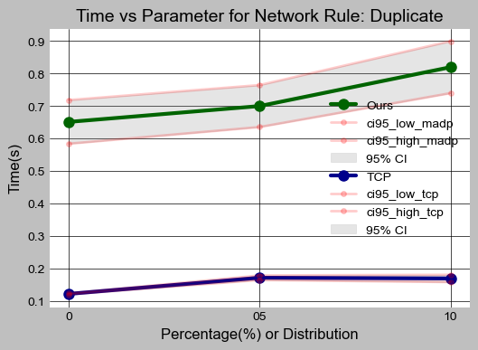 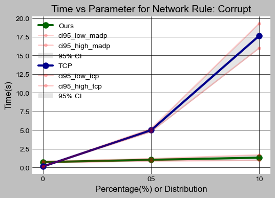 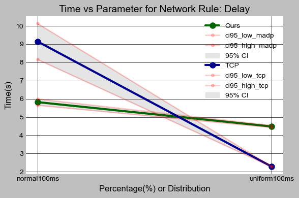 [alt text](README.md) -->

	<!-- Place above images in a structured format -->
	<h1> Scripting Multi-Player Game </h1>
	
	  
&nbsp;&nbsp;&nbsp;&nbsp;
	<h1> Computer Networking - RDT </h1>
	
	
	
	<h1> Computer Graphics </h1>
	
	
	
	  
&nbsp;&nbsp;&nbsp;&nbsp;
	<h1> TradeBoard </h1>
	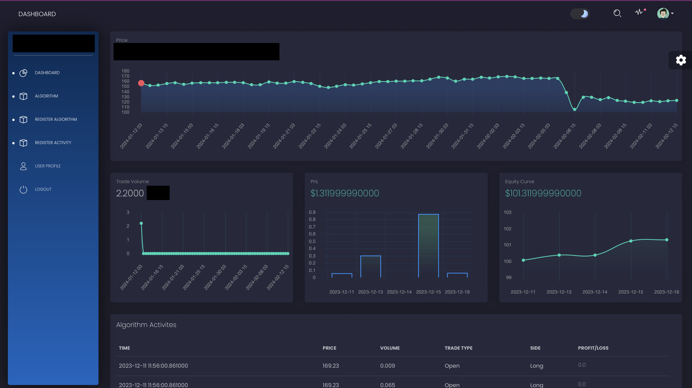
	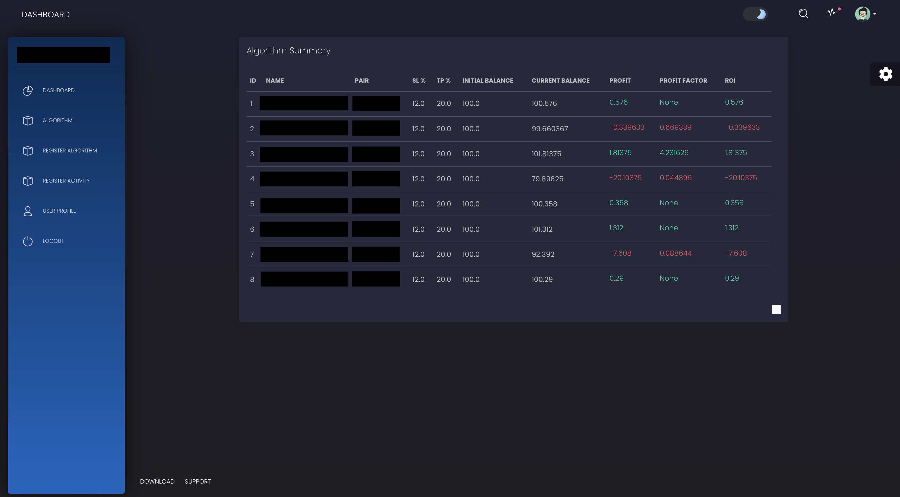
	  
	<h1> SimTest </h1>
	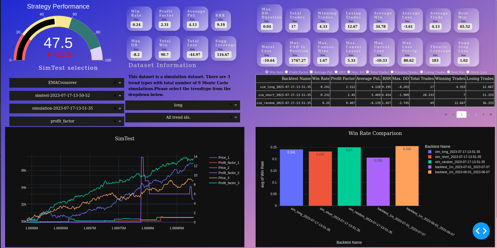
	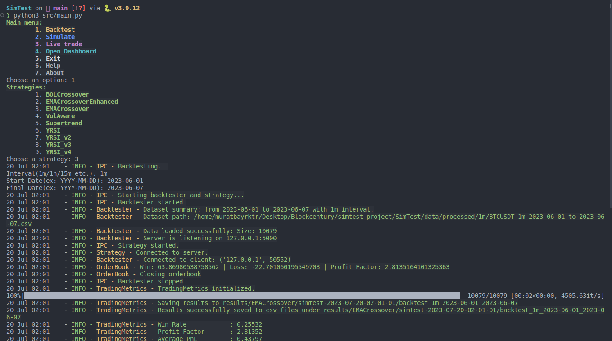
	<h1> Satisfiability Solver </h1>
	
	  
	<h1> Deep Learning </h1>
	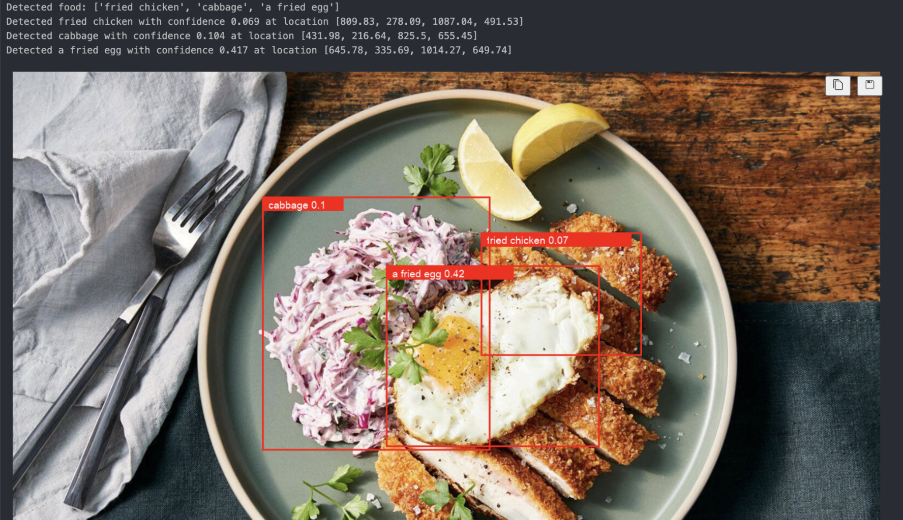
	  

  

<!-- above figure in html format is below -->

	

<!--
**muratbayrktr/muratbayrktr** is a ✨ _special_ ✨ repository because its `README.md` (this file) appears on your GitHub profile.

Here are some ideas to get you started:

- 🔭 I’m currently working on ...
- 🌱 I’m currently learning ...
- 👯 I’m looking to collaborate on ...
- 🤔 I’m looking for help with ...
- 💬 Ask me about ...
- 📫 How to reach me: ...
- 😄 Pronouns: ...
- ⚡ Fun fact: ...
-->
